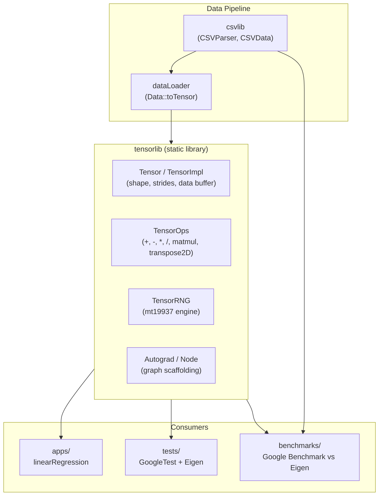

# TensorLib


A dependency-free C++23 tensor computation library built for low-level ML infrastructure work, numerical computing research, and education in systems-level deep learning primitives.

TensorLib provides an N-dimensional tensor core with shape/stride-aware indexing, broadcasting, matrix operations, CSV-based data loading, and a benchmark suite that directly compares performance against Eigen.

---

## Table of Contents

- [Problem Statement](#problem-statement)
- [Solution](#solution)
- [Key Features](#key-features)
- [Architecture](#architecture)
- [Technology Stack](#technology-stack)
- [Installation](#installation)
- [Project Structure](#project-structure)
- [Usage](#usage)
- [API Documentation](#api-documentation)
- [Design Decisions](#design-decisions)
- [Performance Considerations](#performance-considerations)
- [Security](#security)
- [Roadmap](#roadmap)
- [Contributing](#contributing)
- [License](#license)
- [Authors](#authors)
- [Recommended Additions](#recommended-additions)

---

## Problem Statement

Most developers learning machine learning systems work exclusively with high-level frameworks (PyTorch, TensorFlow, NumPy) that hide memory layout, broadcasting mechanics, stride computation, and numerical kernels behind heavily optimized, opaque implementations. This abstraction accelerates application development but limits understanding of:

- How tensors are represented in memory (contiguous buffers, strides, shapes)
- How broadcasting and elementwise operations are implemented at the loop level
- How matrix multiplication, transposition, and reductions perform without vectorized BLAS backends
- How allocation patterns and cache behavior affect real-world ML workload performance

There is a need for a minimal, transparent, from-scratch tensor library that exposes these mechanics directly, while remaining usable enough to build real models (e.g., linear regression) end to end.

## Solution

TensorLib implements a tensor core and operator set from first principles in modern C++23, with no external runtime dependencies. It provides:

- A `Tensor` class backed by a flat `std::unique_ptr<float[]>` buffer with explicit shape and stride metadata (up to rank 8)
- A broadcasting-aware operator set (`+`, `-`, `*`, `/`, `matmul`, `transpose2D`) implemented with explicit N-dimensional index loops
- Factory methods for zero/one initialization and randomized initialization (Normal, He, Xavier, and their uniform variants)
- A CSV parser and data loader that converts tabular data directly into tensors
- A Google Benchmark suite that benchmarks every core operation against an equivalent Eigen implementation at matched problem sizes, making performance tradeoffs explicit and measurable
- A working linear regression example trained end-to-end using only TensorLib primitives

This makes TensorLib suitable both as a teaching tool for tensor internals and as a baseline for systems-level performance experimentation.

## Key Features

| Feature | Description |
|---|---|
| **N-dimensional tensor core** | Supports tensors up to rank 8 with row-major layout, explicit shape and stride arrays, and scalar (rank-0) tensors. |
| **Factory helpers** | `createZeros`, `createOnes`, `createScalar`, `createTensor`, and `createRandTensor` with `Normal`, `He`, `Xavier`, `HeUniform`, and `XavierUniform` initialization schemes. |
| **Broadcasting-aware elementwise ops** | `+`, `-`, `*`, `/` support same-shape fast paths and full NumPy-style broadcasting via a generic `binaryKernel` template. |
| **Matrix operations** | `matmul` (ikj loop order) and `transpose2D` for 2D tensors. |
| **Loss and activation functions** | `calcCost` (SSE/MSE), `sigmoid`, `relu`, `leakyRelu`, `m_tanh`. |
| **Scaling utilities** | `minMaxScaler` for feature normalization (standard/max scalers planned — see [Roadmap](#roadmap)). |
| **CSV data pipeline** | `CSVParser::readCSV` parses delimited files into a column-major `CSVData` structure; `Data::toTensor` converts named columns directly into `Tensor` objects. |
| **Autograd scaffolding** | `Node`/`Autograd` registry for future computation-graph tracking (not yet wired into operators). |
| **Benchmark suite** | 12 benchmark sections comparing TensorLib against Eigen across allocation, memory access, elementwise ops, matmul, transposition, activations, and realistic ML workloads (MLP forward pass, attention, linear regression step). |
| **Reference application** | A linear regression example trained via manual gradient descent on a salary dataset, using min-max scaling and TensorLib tensor ops exclusively. |
| **Test coverage** | GoogleTest suite covering scalar/1D/2D/3D/high-rank tensors, factory functions, shape validation, elementwise ops, transpose, matmul, and floating-point edge cases. |

## Architecture

TensorLib is organized as a set of independent CMake subprojects linked into a single static library (`tensorlib`) plus supporting libraries for CSV parsing and data loading.



### Component Overview

**Tensor Core (`tensor/`)** — Owns the underlying float buffer via `TensorImpl`, computes shape/strides/rank, and exposes factory methods, indexing operators (`operator()` for 0D/1D/2D/3D access), reshape, and min/max queries.

**Operations (`tensor/src/ops`)** — Implements broadcasting via `computeBroadcast`, a generic `binaryKernel<Op>` template for arbitrary elementwise operations, plus dedicated fast paths for same-shape operands, `matmul`, `transpose2D`, and loss/activation functions.

**CSV Library (`csvlib/`)** — Streams a delimited file into a flat `std::vector<float>` with column-major layout and a feature-name-to-index map, handling missing values as NaN and dynamically resizing for unknown row counts.

**Data Loader (`dataLoader/`)** — Bridges `CSVData` into `Tensor` objects by feature name, used by the example application.

**Applications (`apps/`)** — Contains a linear regression example that loads a CSV, normalizes features with `minMaxScaler`, and trains via manual SGD using only TensorOps primitives.

**Tests (`tests/`)** — GoogleTest-based suite validating tensor invariants, operator correctness, broadcasting, shape mismatches, and floating-point edge cases (NaN/Infinity propagation).

**Benchmarks (`benchmarks/`)** — Google Benchmark suite with a 1:1 TensorLib-vs-Eigen comparison for every major operation category, including realistic ML workloads.

## Technology Stack

### Frontend
Not applicable — TensorLib is a C++ library with no UI layer.

### Backend
| Component | Technology |
|---|---|
| Core language | C++23 |
| Build system | CMake 3.20+ |
| Tensor core | Custom implementation (no external tensor runtime) |

### Database
Not applicable — data is consumed from flat CSV files via `csvlib`.

### AI/ML
| Component | Technology |
|---|---|
| Tensor operations | Custom (elementwise ops, broadcasting, matmul, transpose) |
| Initialization schemes | Normal, He, Xavier, HeUniform, XavierUniform |
| Loss functions | SSE, MSE |
| Activations | Sigmoid, ReLU, Leaky ReLU, Tanh |
| Reference implementation | Linear regression via manual gradient descent |
| Validation baseline | Eigen 3.4.0 (used in tests and benchmarks only) |

### Infrastructure
| Component | Technology |
|---|---|
| Dependency management | CMake `FetchContent` (GoogleTest, Google Benchmark, Eigen) |
| Sanitizers | AddressSanitizer + UndefinedBehaviorSanitizer (Debug builds) |

### DevOps
| Component | Technology |
|---|---|
| Testing | GoogleTest + CTest, discovered via `gtest_discover_tests` |
| Benchmarking | Google Benchmark, with a registered smoke test (`bench_tensor_smoke`) |
| Compiler warnings | `-Wall -Wextra -Wpedantic -Wshadow -Wconversion -Wsign-conversion -Wreorder -Werror` (tensorlib, tests) |

### Other Tools
| Component | Technology |
|---|---|
| Data generation (examples) | Python (`SpiralDataGen.py`, `plotResults.py`) using NumPy and Matplotlib |
| Reference dataset | `Salary_dataset_large.csv` (consumed by the linear regression app) |

---

## Installation

### Prerequisites

- A C++23-capable compiler (GCC 13+, Clang 16+, or MSVC with `/std:c++23` support)
- CMake 3.20 or later
- Git (for `FetchContent` dependency retrieval)
- Internet access on first configure (GoogleTest, Google Benchmark, and Eigen are fetched automatically if not found locally)

### Setup Steps

```bash
# 1. Clone the repository
git clone https://github.com/CarvedCoder/TensorLib.git
cd TensorLib

# 2. Configure (Release build)
cmake -S . -B build -DCMAKE_BUILD_TYPE=Release

# 3. Build all targets
cmake --build build
```

For a debug build with sanitizers enabled:

```bash
cmake -S . -B build-debug -DCMAKE_BUILD_TYPE=Debug
cmake --build build-debug
```

### Running the Project

**Run the test suite:**
```bash
ctest --test-dir build
```

**Run the linear regression example:**
```bash
./build/apps/linearRegression
```
> Update the dataset path in `apps/linearRegression.cpp` (currently `../../Datasets/Salary_dataset_large.csv`) to point at your local data before running.

**Run the benchmark suite:**
```bash
./build/benchmarks/bench_tensor --benchmark_counters_tabular=true

# Filter to a specific category
./build/benchmarks/bench_tensor --benchmark_filter="MatMul"

# Export results to JSON
./build/benchmarks/bench_tensor --benchmark_out=results.json --benchmark_out_format=json
```

---

## Project Structure

```
TensorLib/
├── tensor/                  # Core library (tensorlib)
│   ├── include/tensorlib/   # Public headers (tensor, ops, autograd, RNG)
│   └── src/                 # Implementation (tensor, ops, autograd, RNG)
├── csvlib/                  # CSV parsing library
│   ├── include/csvlib/
│   └── src/
├── dataLoader/              # CSV-to-Tensor conversion helpers
│   ├── include/dataLoader/
│   └── src/
├── apps/                     # Example applications
│   ├── linearRegression.cpp # End-to-end linear regression demo
│   └── test.cpp              # Placeholder application entry point
├── tests/                    # GoogleTest unit tests
│   └── test_tensor.cpp
├── benchmarks/               # Google Benchmark suite (vs. Eigen)
│   ├── bench_tensor.cpp
│   └── benchmark.txt         # Sample benchmark output
├── CMakeLists.txt            # Root build configuration
└── LICENSE                    # MIT License
```

| Path | Purpose |
|---|---|
| `tensor/include/tensorlib/tensor/tensor.h` | `Tensor` class declaration: factories, indexing, reshape, strides |
| `tensor/include/tensorlib/tensor/tensor_impl.h` | `TensorImpl`: underlying buffer, shape, strides, rank, grad storage |
| `tensor/include/tensorlib/ops/ops.h` | Operator declarations, `BroadcastInfo`, generic `binaryKernel` template |
| `tensor/src/ops/ops.cpp` | Operator implementations, broadcasting logic, matmul, transpose, losses, activations |
| `tensor/src/tensor/tensor.cpp` | Tensor construction, factories, random initialization, indexing |
| `csvlib/include/csvlib/csv.h` / `src/csv.cpp` | CSV parsing into `CSVData` |
| `dataLoader/include/dataLoader/loader.h` / `src/loader.cpp` | `Data::toTensor` conversion helpers |
| `apps/linearRegression.cpp` | End-to-end training example |
| `tests/test_tensor.cpp` | Correctness and edge-case test suite |
| `benchmarks/bench_tensor.cpp` | Performance comparison suite |

---

## Usage

### Basic Tensor Creation and Operations

```cpp
#include <tensorlib/tensor.h>
#include <tensorlib/ops.h>

using namespace TensorOps;

// Create tensors
auto a = Tensor::createOnes({2, 2});
auto b = Tensor::createRandTensor({2, 2}, InitType::He);

// Elementwise and matrix operations
auto sum = a + b;
auto product = matmul(a, b);
auto transposed = transpose2D(a);
```

### Loading Data from CSV

```cpp
#include <csvlib/csv.h>
#include <dataLoader/loader.h>

CSVData csv_data = CSVParser::readCSV("data.csv");
Tensor features = Data::toTensor(csv_data, "YearsExperience");
Tensor target = Data::toTensor(csv_data, "Salary");
```

### Training a Simple Model (Linear Regression)

```cpp
auto norm_x = minMaxScaler(x);
auto norm_y = minMaxScaler(y);

auto w = Tensor::createRandTensor({1});
auto b = Tensor::createRandTensor({1});

for (int epoch = 0; epoch < 10000; epoch++) {
    auto y_pred = w * norm_x + b;
    auto diff = y_pred - norm_y;
    // Compute gradients and update w, b manually
}
```

The full working example is available in [`apps/linearRegression.cpp`](apps/linearRegression.cpp).

---

## API Documentation

TensorLib is a library, not a network service — there are no HTTP endpoints. The public API surface consists of the following core types and functions.

### `Tensor` (tensorlib/tensor.h)

| Method | Description |
|---|---|
| `Tensor::createZeros(shape)` | Creates a tensor filled with zeros. |
| `Tensor::createOnes(shape)` | Creates a tensor filled with ones. |
| `Tensor::createScalar(value)` | Creates a rank-0 scalar tensor. |
| `Tensor::createTensor(data, shape, requires_grad)` | Creates a tensor from raw data, copying or taking ownership. |
| `Tensor::createRandTensor(shape, InitType)` | Creates a randomly initialized tensor (`Normal`, `He`, `Xavier`, `HeUniform`, `XavierUniform`). |
| `getShape()` / `getStrides()` / `getRank()` / `getTotalSize()` | Metadata accessors. |
| `operator()(i)`, `operator()(i, j)`, `operator()(i, j, k)` | Bounds-checked element access for rank 1–3 tensors. |
| `getDataPtr()` / `getMutableDataPtr()` | Raw buffer access for performance-critical code. |
| `reshape(shape)` | Metadata-only reshape (no data copy); throws if element count mismatches. |
| `getMinMax()` | Returns the min/max values in the tensor. |

### `TensorOps` (tensorlib/ops.h)

| Function | Description |
|---|---|
| `operator+`, `operator-`, `operator*`, `operator/` | Elementwise binary operations with broadcasting support. |
| `operator*(Tensor, float)` | Scalar multiplication. |
| `matmul(t1, t2)` | 2D matrix multiplication (throws on rank or dimension mismatch). |
| `transpose2D(t)` | Transposes a 2D tensor (throws on rank ≠ 2). |
| `calcCost(t1, t2, LossType)` | Computes SSE or MSE between two same-shape tensors. |
| `sigmoid`, `relu`, `leakyRelu`, `m_tanh` | Scalar activation functions. |
| `minMaxScaler(t)` | Normalizes tensor values to `[0, 1]` based on global min/max. |

### `CSVParser` (csvlib/csv.h)

| Function | Description |
|---|---|
| `CSVParser::readCSV(path, delim)` | Parses a delimited file into a `CSVData` structure. |
| `CSVParser::getColumnData(csv, feature)` | Returns a `std::span<const float>` view of a named column. |

### `Data` (dataLoader/loader.h)

| Function | Description |
|---|---|
| `Data::toTensor(csv_data, feature)` | Converts a named CSV column into a 1D `Tensor`. |
| `Data::toTensor(vector<float>&)` | Converts a raw float vector into a 1D `Tensor`. |

---

## Design Decisions

**Flat buffer with explicit strides over nested containers.** `TensorImpl` stores data as a single `std::unique_ptr<float[]>` with a fixed-size `std::array<size_t, MAX_RANK>` for shape and strides (`MAX_RANK = 8`). This avoids pointer-chasing and per-dimension allocations, keeping memory contiguous and cache-friendly, at the cost of a fixed maximum rank.

**Row-major layout.** Strides are computed so the last dimension is contiguous, matching C/C++ array conventions and simplifying interop with raw pointers and Eigen's `RowMajor` matrices in benchmarks.

**Generic broadcasting via `binaryKernel<Op>`.** Rather than writing a separate implementation for each operator, `computeBroadcast` produces stride/shape metadata once, and a templated kernel applies any binary functor (`std::plus`, `std::minus`, etc.) across the broadcasted shape. Same-shape operands bypass this path with a direct loop for performance.

**Eager evaluation, no expression templates.** Every binary operation allocates and returns a new `Tensor`. This keeps the implementation simple and easy to reason about, but means chained expressions (e.g., `(a + b) * c - d`) allocate one intermediate tensor per operation — a deliberate simplicity-over-performance tradeoff, made explicit and measurable in the benchmark suite (see `BM_TL_Chain_*` vs `BM_EG_Chain_*`).

**`matmul` uses `ikj` loop ordering without tiling or SIMD.** This ordering improves cache locality over naive `ijk` while remaining simple and portable. It intentionally does not match BLAS-level performance — the benchmark suite quantifies the gap against Eigen at multiple problem sizes to make this tradeoff visible rather than hidden.

**Autograd scaffolding is present but not wired in.** The `Node`/`Autograd` registry exists to support future computation-graph tracking, but operators do not currently build a graph. This is an explicit, incremental design choice — correctness and clarity of forward operations come first.

**CSV parser assumes a fixed column count and grows row capacity dynamically.** `CSVParser::readCSV` starts with an initial row estimate (1024) and doubles capacity as needed, then trims to the actual row count. This avoids repeated small allocations for large files at the cost of a temporary over-allocation.

---

## Performance Considerations

TensorLib ships with a comprehensive Google Benchmark suite (`benchmarks/bench_tensor.cpp`) that compares every major operation against Eigen at matched sizes. Representative results (see `benchmarks/benchmark.txt` for the full output):

| Operation | TensorLib | Eigen | Observation |
|---|---|---|---|
| 512×512 matmul | ~14.2 ms (≈19 GFLOP/s) | ~2.18 ms (≈124 GFLOP/s) | Eigen's blocked GEMM significantly outperforms TensorLib's `ikj` loop at scale. |
| Elementwise add (1K elements) | ~0.17 µs | ~0.04 µs | Broadcasting overhead and lack of vectorization dominate at small sizes. |
| Chained `(a+b)*c-d` (1M elements) | ~2.5 ms, 3 allocations | ~0.56 ms, 1 allocation | Eager evaluation costs extra allocations vs. Eigen's expression templates. |
| Reshape (metadata-only) | ~22.6 ns | ~0.028 ns | Both are effectively zero-copy; absolute difference is negligible in practice. |
| 1000× repeated accumulation | ~621 µs (1000 allocs) | ~133 µs (in-place) | Highlights the cost of eager allocation in tight loops. |

**Key takeaways:**

- TensorLib's same-shape fast paths (`operator+`, `-`, `*`, `/`) avoid the general broadcasting loop and perform competitively for small-to-medium 1D arrays.
- Performance gaps widen with problem size, primarily due to the absence of SIMD vectorization, cache tiling, and expression-template fusion — all explicit areas for future optimization (see [Roadmap](#roadmap)).
- The benchmark suite is the canonical source of truth for performance claims; run it locally (`--benchmark_filter`) to reproduce results on your hardware.
- `reshape` is metadata-only and does not copy underlying data, matching the cost profile of Eigen's `Map<>` zero-copy views.

No caching layer, concurrency model, or distributed execution is implemented — TensorLib targets single-threaded, in-process numerical computation.

---

## Security

TensorLib is a computational library with no network exposure, authentication, or persistent storage of sensitive data. Relevant considerations:

- **Input validation:** Shape mismatches, invalid ranks, and out-of-bounds indexing throw `std::invalid_argument` or `std::out_of_range` rather than causing undefined behavior in release builds.
- **Memory safety:** Debug builds (`CMAKE_BUILD_TYPE=Debug`) enable AddressSanitizer and UndefinedBehaviorSanitizer globally to catch memory and UB issues during development and testing.
- **CSV parsing:** Malformed numeric fields raise `std::invalid_argument` via `std::from_chars`; missing fields are filled with `NaN` rather than causing parse failures.
- **No external network calls:** All dependencies are fetched at build time via CMake `FetchContent` from pinned versions/tags (GoogleTest `v1.14.0`, Google Benchmark `v1.8.3`, Eigen `3.4.0`).

As a numerical library, TensorLib does not handle user authentication, encryption, or authorization — these concerns are out of scope for this project.

---

## Roadmap

### Current
- N-dimensional tensor core (rank ≤ 8) with broadcasting
- Elementwise arithmetic, matmul, 2D transpose
- He/Xavier/Normal initialization
- CSV-based data loading
- MSE/SSE loss and basic activations
- Linear regression example
- GoogleTest coverage and Eigen-benchmarked performance suite

### Planned
- Full autograd / backpropagation support, building on the existing `Node`/`Autograd` registry
- Additional tensor operations: convolution, general reductions (sum, mean, max along axes), slicing/indexing views
- `standardScaler` and `maxScaler` implementations (declared in `ops.h`, not yet implemented)
- SIMD-vectorized elementwise kernels and tiled/blocked `matmul`
- Optional GPU backend (CUDA or similar)
- Expanded dataset utilities and additional example applications beyond linear regression

---

## Contributing

Contributions are welcome. To propose a change:

1. Open an issue describing the bug or feature before starting significant work.
2. Fork the repository and create a feature branch.
3. Ensure `tensorlib` and `test_tensor` build cleanly with warnings treated as errors (`-Werror` / `/WX`).
4. Add or update tests in `tests/test_tensor.cpp` for any behavioral change.
5. If the change affects performance-critical code, add or update the corresponding benchmark in `benchmarks/bench_tensor.cpp`.
6. Submit a pull request with a clear description of the change and its motivation.

---

## License

Distributed under the MIT License. See [LICENSE](LICENSE) for details.